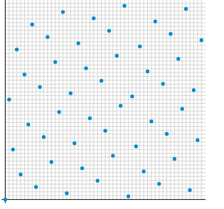

怎么处理被遮挡的部分的反射

## 检测标准：
. 需要光泽贴图，表示粗糙度
. 金属的漫反射为0，所以去掉反射的话为黑色

## brdf 贴图的格式

## env 贴图的格式

## albedo 的计算
暴力采样？

##IBL
Hammersley 随机采样
是一种采样模式，也可用于shadowmap或者ssao
http://holger.dammertz.org/stuff/notes_HammersleyOnHemisphere.html#wong97
Van der Corput sequence：把数字i，从小数点那里镜像一下，就变成了一个1到0之间的小数。
用这个序列得到的点(i,vdcs(i)),就是一个x轴一直增加，y是0到1之间差不多随机的一个东西:  
0，0.5， 0.75... 

  
如果取N个，可以i/N

##LUT

##
diff angle
    如果各向同性，则view的绝对方向并不重要，只要diff就行

##
多采样
例如普通的blinn，是不是也要多采样，
    sample(dir1)*dir1scale?

## image slice view
x：half angle ，0到90  
y: diff angle ，0到90

## 原来出现的x形分界面是怎么回事
是不是光照计算并不准确导致的，相加的地方并没有正确融合

## 透明层
一层非金属的透明层，根据材质会有不同的散射率，遇到底层的金属以后，会再走brdf流程，然后在反射回来

## albedo贴图制作
标准24色色卡
去掉高光和阴影
去掉diffuse光照

## 参考
1. CE3的光照和工具算法等介绍
http://blog.selfshadow.com/publications/s2012-shading-course/mcauley/s2012_pbs_farcry3_slides_v2.pdf

## Gauss-Jordan elimination
可以用来解方程，具体原理和实现可以参考 https://zh.wikipedia.org/wiki/高斯消去法